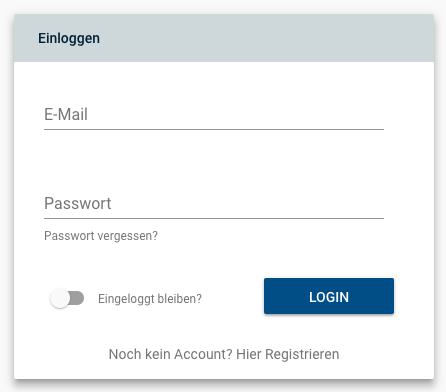

# Firebase Authenticator



Needs MaterialUI with theme, firebase and react.

1. Install the firebase dependency via npm (tested with firebase 5.3.0)

```
npm install firebase --save
```

2. Set Callback Method

The callback for the auth state change must be initialized as high as possible in the component hirarchy. For example in the App.tsx

```
import Firebase from './FirebaseApp';
...
componentWillMount() {
        // Callback for Auth State Changes
        if (Firebase.auth) {
            Firebase.auth().onAuthStateChanged((user: any) => {
                if (user) {
                    // User Login Actions
                } else {
                   // User Logout Actions
                }
            });
        }

    }
```

3. Configure FirebaseApp.tsx

```
const config = {
    apiKey: 'CONFIG.FIREBASE.APIKEY',
    authDomain: 'CONFIG.FIREBASE.AUTHDOMAIN',
    databaseURL: 'CONFIG.FIREBASE.DATABASEURL',
    projectId: 'CONFIG.FIREBASE.PROJECTID',
    storageBucket: 'CONFIG.FIREBASE.STORAGEBUCKET',
    messagingSenderId: 'CONFIG.FIREBASE.MESSAGINGSENDERID'
};
```

4. Copy the firebase.d.ts typings into the main "typings" folder

5. Create authenticator

window.open('Url or endpoit', _blank) is called for the urls

```
    <Authenticator
        onSuccess={() => /* Action after Success */ }
        privacyPolicyUrl={/* Url or endpoint to the privacyPolicy */ }
        siteNoticeUrl={/* Url or endpoint to the siteNotice */ }
    />
```

6. Control all paths to the imports
